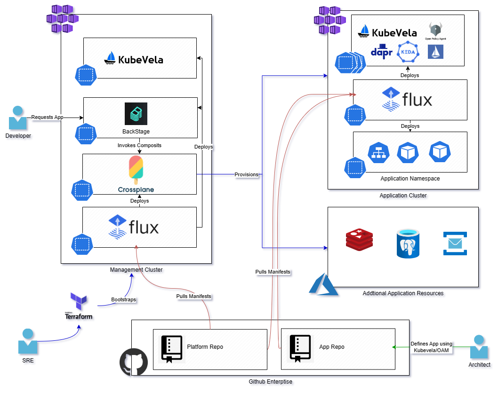

# Overview

This repository is a demonstration of using Crossplane/Upbound with KubeVela in Azure on AKS. It is currently a work in progress

* [Crossplane](https://www.crossplane.io/) is an open source Kubernetes add-on that transforms your cluster into a universal control plane. Crossplane enables platform teams to assemble infrastructure from multiple vendors, and expose higher level self-service APIs for application teams to consume, without having to write any code.
* [KubeVela](https://kubevela.io/docs/) is a modern software delivery control plane that strides to make deploying and operating applications across today's multi-cloud environments easier, faster and more reliable.  
* [Crossplane with Kubevela](https://kubevela.io/docs/platform-engineers/crossplane/)

# Design

---

# Prerequisites 
* Azure Subscription
* [Azure Cli](https://github.com/briandenicola/tooling/blob/main/azure-cli.sh)
* [Terraform](https://github.com/briandenicola/tooling/blob/main/terraform.sh)
* [Task](https://github.com/briandenicola/tooling/blob/main/task.sh)
* [Vela Cli](https://github.com/briandenicola/tooling/blob/main/kubevela.sh)
* [Upbound Cli](https://github.com/briandenicola/tooling/blob/main/upbound.sh)

# Quicksteps
```bash
    az login --scope https://graph.microsoft.com/.default
    task up
```

# Sample AKS Cluster Deployed via Crossplane
```bash
    #Create a simple resource group
    kubectl apply -f ./manifests/crossplane/resourcegroup.yaml

    #Create a virtual network and AKS cluster named aks02
    kubectl apply -f ./manifests/crossplane/akscluster.yaml

    kubectl get kubernetescluster
    NAME    READY   SYNCED   EXTERNAL-NAME   AGE
    aks02   True    True     aks02           13m

    #Make a Claim against a Composite Resource (XR)
    kubectl apply -f ./manifests/crossplane/composite/
    kubectl get compositeresourcedefinition.apiextensions.crossplane.io xclusters.aks.bjdazure.tech
    NAME                                     ESTABLISHED   OFFERED   AGE
    xaksclusters.containers.bjdazure.tech    True          True      62s

    kubectl get compositions
    NAME           AGE
    xcluster-dev   6m50s

    kubectl apply -f ./manifests/crossplane/aksclaim.yaml

    kubectl get get aksclusters.containers.bjdazure.tech/aks03
    NAME    SYNCED   READY   CONNECTION-SECRET   AGE
    aks03   True     False                       32s

    ...
    kubectl get get aksclusters.containers.bjdazure.tech/aks03
    NAME    SYNCED   READY   CONNECTION-SECRET   AGE
    aks03   True     True                        32s

    kubectl get  resourcegroup,virtualnetwork,subnet,kubernetes
    NAME    READY   SYNCED   EXTERNAL-NAME   AGE
    aks03   True    True     aks03           13m
```


# Sample KubeVela Commands and Configurations
``` bash
    # Add Addons to Deployment
    vela addon registry add experimental --type=helm --endpoint=https://addons.kubevela.net/experimental/
    vela addon enable fluxcd
    vela addon enable helm
    vela addon enable vela-workflow
    #vela addon enable terraform-azure
    #vela addon enable crossplane

    # UI 
    vela addon enable velaux
    vela port-forward addon-velaux -n vela-system

    # Add additional clusters
    vela cluster join <your kubeconfig path>
    vela cluster list

    # Deploy applications 
    vela env init prod --namespace prod
    vela up -f https://kubevela.net/example/applications/first-app.yaml
    vela status first-vela-app
    vela port-forward first-vela-app 8000:8000
    vela workflow resume first-vela-app
```

# Additional References
## Crossplane
* https://docs.crossplane.io/v1.11/concepts/terminology/
* https://docs.crossplane.io/v1.10/cloud-providers/azure/azure-provider/
* https://docs.crossplane.io/v1.11/concepts/composition/
* https://github.com/PacktPublishing/End-to-End-Automation-with-Kubernetes-and-Crossplane/tree/main/Chapter09/Hand-on-examples
* https://marketplace.upbound.io/providers/upbound/provider-azure/
* https://github.com/vfarcic/devops-toolkit-crossplane
## Kubevela
* https://kubevela.io/docs/platform-engineers/traits/customize-trait/
* https://kubevela.io/docs/getting-started/core-concept
* https://github.com/kubevela/terraform-controller
## Other
* https://gist.github.com/vfarcic/6d40ff0847a41f1d1607f4df73cd5bad
* https://open-cluster-management.io/
* https://cuelang.org/
* https://www.youtube.com/watch?v=Ii-lpLuzPxw

# Backlog
- [X] Learn Crossplane
- [X] Learn KubeVela
- [ ] Learn Backstage
- [ ] Update automation to deploy app from Backstage to newly created cluster through Crossplane and Flux
