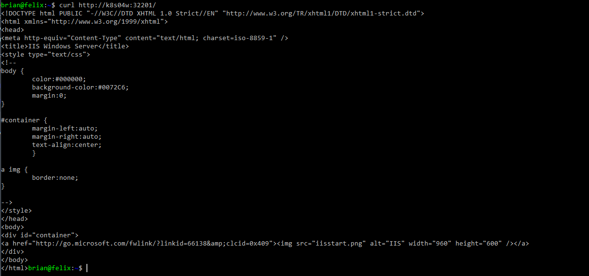

# Overview
I wanted to add a Windows node to my Kubernetes cluster and I found the documentation online to be not to my liking. I liked documentation that is complete but boiled down to just the steps required to get up and running.  Every setup is different, but I want to show how I added a Windows Nodes to an existing Kubernetes cluster. If you are looking for a fully automated deploy checkout pablodav via the link below for a complete Ansible solution. 

## Full Documentation  
* [Ansible Recipe by pablodav](https://github.com/pablodav/kubernetes-for-windows)
* [Microsoft](https://docs.microsoft.com/en-us/virtualization/windowscontainers/kubernetes/joining-windows-workers)
* [Kubernetes.io](https://kubernetes.io/docs/getting-started-guides/windows/)

## Prerequisite  and Cluster Overview
* A kubernetes cluster at least v1.12.5 or higher.  I had to upgrade my cluster to v1.13.2
* My cluster is setup on my Hyper-V host in my own network
* The cluster is 3 nodes - 1 master (k8s01) and 2 Centos/Linux workers (k8s02/k8s03)
* The Windows node will be k8s04w.
* All servers are resolvable in DNS 
* The cluster was setup kubeadm 
	* kubeadm init --pod-network-cidr=192.168.0.0/16' 
	* kubeadm join --token {} k8s01:6443

# Gather Cluster Information
* The scripts and setup requires a few details from your existing cluster - specific the Cluster CIDR, Services CIDR, and Kube DNS
* Kube DNS (KubeDnsServiceIp)
	* kubectl -n kube-system get service kube-dns -o jsonpath='{.spec.clusterIP}'
	* In my example, Kube DNS is 10.96.0.10
* Cluster CIDR (clusterCIDR)
 	* kubectl cluster-info dump | grep -i -m 1 cluster-cidr 
	* In my example, the CIDR is 192.168.0.0/16. A lot of times this will be 10.244.0.0/16
* Services CIDR (serviceCIDR)
 	* kubectl cluster-info dump | grep -i -m 1 service-cluster-ip-range
	* In my example, the CIDR is  10.96.0.0/12
	
# Cluster Preparation
* Remove Calico networking. 
	* Windows does not support Calico yet and my existing cluster had it configured so I had to remove it. 
	* Rebooted existing nodes 
* Patch KubeProxy
	* KubeProxy runs as a daemonset if you setup your cluster with kubeadm. We need to patch it to only run on Linux nodes.
	* Setup
		* wget https://raw.githubusercontent.com/Microsoft/SDN/master/Kubernetes/flannel/l2bridge/manifests/node-selector-patch.yml
		* kubectl patch ds/kube-proxy --patch "$(cat node-selector-patch.yml)" -n=kube-system
* Install Flannel Networking. 
	* Windows supports a few other networking types but I am going with flannel in my setup.
	* Flannel runs as daesmonset so it will also need to be patched to only run on Linux nodes. 
	* Setup
		* wget https://raw.githubusercontent.com/coreos/flannel/master/Documentation/kube-flannel.yml
		* vi  kube-flannel.yml to update Cluster CIDR and backend type.
			```
			net-conf.json: |
		    {
		      "Network": "192.168.0.0/16",  #clusterCIDR
		      "Backend": {
		        "Type": "host-gw"  #Changed from vxlan to host-gw
		      }
			}
			```
		* kubectl apply -f kube-flannel.yml
		* kubectl patch ds/kube-flannel-ds-amd64 --patch "$(cat node-selector-patch.yml)" -n=kube-system


# Configure Windows 2019 
* Install Windows 2019 virtual machine
	* I configured the server using my [setup script](https://github.com/bjd145/PSScripts/blob/master/DesireStateConfiguration/Setup-ServerCore.ps1)
* Setup Docker
	* Install-WindowsFeature -Name Containers
	* Install-Module -Name DockerMsftProvider -Repository PSGallery -Force
	* Install-Package -Name Docker -ProviderName DockerMsftProvider
	* Set-Service -Name Docker -StartupType Automatic
	* Start-Service -Name Docker
* Pull Based Windows Containers
	* docker pull mcr.microsoft.com/windows/nanoserver:1809
	* docker tag mcr.microsoft.com/windows/nanoserver:1809 mcr.microsoft.com/windows/nanoserver:latest
	* docker pull mcr.microsoft.com/windows/servercore:1809
	* docker tag mcr.microsoft.com/windows/servercore:1809 mcr.microsoft.com/windows/servercore:latest
	* docker run mcr.microsoft.com/windows/nanoserver:latest
* Install and Configure Kubernetes
	* powershell
	* mkdir c:\Installs
	* Invoke-WebRequest -UseBasicParsing -Uri https://dl.k8s.io/v1.13.2/kubernetes-node-windows-amd64.tar.gz -OutFile c:\Installs\kubernetes-node-windows-amd64.tar.gz
	* tar zxvf c:\Installs\kubernetes-node-windows-amd64.tar.gz
		* Windows 2019 has tar and scp and other posix utils built in
	* mkdir c:\k
		* c:\k seems to be the convention for Kubernetes on Windows so I am going to use that going forward
	* mkdir c:\k\logs
	* cd c:\k
	* cp c:\installs\kubernetes\node\bin\* .
	* scp brian@k8s01:/home/brian/.kube/config .
	* setx /m KUBECONFIG", "C:\k\config"
	* Invoke-WebRequest -UseBasicParsing -Uri https://github.com/Microsoft/SDN/archive/master.zip -o master.zip
		* Microsoft has created several PowerShell scripts to help setup Flannel and Kubernetes. 
	* Expand-Archive master.zip -DestinationPath master
	* mv master/SDN-master/Kubernetes/flannel/l2bridge/* C:/k/
	* rm -recurse -force master,master.zip
	* notepad net-conf.json
		```
		net-conf.json: |
	    {
	      "Network": "192.168.0.0/16", #clusterCIDR
	      "Backend": {
	        "Type": "host-gw" #Changed from vxlan to host-gw
	      }
	    }
		```
	* chcp 65001
	* $mgmtIp = Get-NetIPAddress -InterfaceAlias "vEthernet (Ethernet)" -AddressFamily IPv4 | Select-Object -ExpandProperty IPAddress
	* $clusterCIDR = "192.168.0.0/16"
	* $serviceCIDR = "10.96.0.0/12"
	* $KubeDnsServiceIp = "10.96.0.10"
	* .\start.ps1 -ManagementIP $mgmtIp -ClusterCIDR $clusterCIDR -ServiceCIDR $serviceCIDR  -KubeDnsServiceIP $KubeDnsServiceIp
		* The scripts will download additional executables (like flanneld.exe) and the Pause Container (kubeletwin/pause)
		* The scripts will setup kubelet and kubeproxy processes 
		* The scripts will setup Flannel networking using the Host Network Service 
			* This will be call cbr0 ad a l2bridge type
			* Get-HnsNetwork | where Name -imatch cbr0

## Config Windows Services 
* The PowerShell scripts are good for setup and initial testing, but Windows Services is the way to go.
* Setup:
	* setx /m NODE_NAME (hostname)
	* setx /m KUBE_NETWORK cbr0
	* Invoke-WebRequest -UseBasicParsing -Uri https://nssm.cc/release/nssm-2.24.zip -OutFile C:\Installs\\nssm-2.24.zip
	* Expand-Archive  C:\Installs\\nssm-2.24.zip -DestinationPath c:\Installs
	* cp C:\Installs\nssm-2.24\win64\nssm.exe c:\utils\. 
	* $mgmtIp = Get-NetIPAddress -InterfaceAlias "vEthernet (Ethernet)" -AddressFamily IPv4 | Select-Object -ExpandProperty IPAddress
	* $hostname = $ENV:COMPUTERNAME.ToLower()
	* $KubeDnsServiceIp = "10.96.0.10"
	* c:\utils\nssm install flannel c:\flannel\flanneld.exe --kubeconfig-file=C:\k\config --iface=$mgmtIp --ip-masq --kube-subnet-mgr
	* c:\utils\nssm install kubelet c:\k\kubelet.exe --hostname-override=$hostname --pod-infra-container-image=kubeletwin/pause --resolv-conf="" --allow-privileged=true --enable-debugging-handlers --cluster-dns=$KubeDnsServiceIp --cluster-domain=cluster.local --kubeconfig=c:\k\config --hairpin-mode=promiscuous-bridge --image-pull-progress-deadline=20m --cgroups-per-qos=false --log-dir=c:\k\logs --logtostderr=false --enforce-node-allocatable="" --network-plugin=cni --cni-bin-dir=c:\k\cni --cni-conf-dir c:\k\cni\config
	* c:\utils\nssm install kube-proxy c:\k\kube-proxy.exe --proxy-mode=kernelspace --hostname-override=$hostname --kubeconfig=c:\k\config
	* @("kubelet", "kube-proxy", "flannel") | % { Set-Service -Name $_ -StartupType Automatic; Start-Service -Name $_ }
  

# Test 
* kubectl.exe apply -f ./windows.yml
* kubectl.exe expose pod iis3 --port 8080 --target-port=80 --type=NodePort

## Results 


